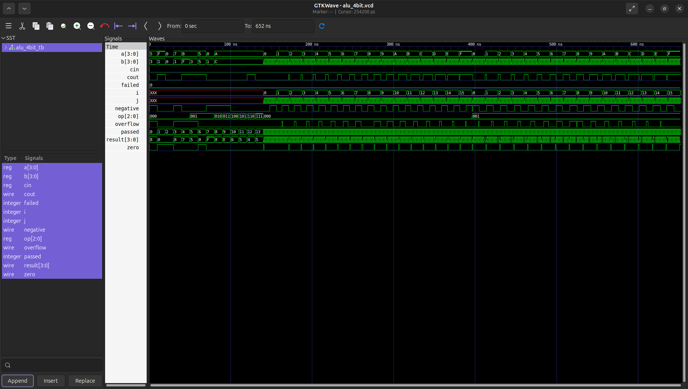

# ⚙️ 4-bit ALU (Arithmetic Logic Unit)

> A synthesizable 4-bit ALU written in Verilog supporting 8 operations — ADD, SUB, AND, OR, XOR, NOT, LSL, LSR — with carry, overflow, zero, and negative flag outputs, verified with an exhaustive self-checking testbench and synthesized to a gate-level netlist using Yosys.


---

## 📖 Overview

The **4-bit ALU** is a fully synthesizable, purely combinational RTL design that performs 8 arithmetic and logic operations on two 4-bit operands selected via a 3-bit `op` code. It produces a 4-bit result alongside four status flags — carry-out, signed overflow, zero, and negative — making it a complete ALU building block suitable for use in a simple CPU datapath.

The design is verified through a rigorous self-checking testbench that includes both targeted edge-case tests and exhaustive 256-combination sweeps for ADD and SUB, then synthesized to a gate-level netlist with Yosys with a schematic generated via Graphviz.

---

## ✨ Features

- ➕ **8 operations** — ADD, SUB, AND, OR, XOR, NOT, LSL, LSR, selected via 3-bit `op`
- 🚩 **4 status flags** — `cout` (carry/borrow), `overflow` (signed), `zero`, `negative`
- ⚡ **Purely combinational** — no clock required; result updates immediately with inputs
- 🔍 **Signed overflow detection** — correct two's complement overflow logic for ADD and SUB
- ✅ **Exhaustive testbench** — 256-case sweeps for ADD and SUB plus targeted edge-case checks with a reusable `check` task validating all outputs simultaneously
- 🗺️ **Gate-level schematic** — Yosys + Graphviz renders the synthesized netlist as a PNG
- 📄 **JSON netlist export** — machine-readable gate-level output for further tooling

---

## 🛠️ Tools Used

| Tool | Purpose |
|------|---------|
| **Icarus Verilog** | RTL simulation and testbench execution |
| **Yosys** | Synthesis from RTL to gate-level netlist |
| **GTKWave** | VCD waveform inspection and debugging |
| **Graphviz** | Renders Yosys `.dot` output to gate-level schematic PNG |

---

## 🔌 Port Description

| Port | Direction | Width | Description |
|------|-----------|-------|-------------|
| `a` | Input | 4-bit | First operand |
| `b` | Input | 4-bit | Second operand |
| `op` | Input | 3-bit | Operation select (see table below) |
| `cin` | Input | 1-bit | Carry-in (reserved for future use) |
| `result` | Output | 4-bit | Operation result |
| `cout` | Output | 1-bit | Carry-out (ADD) / borrow indicator (SUB) |
| `zero` | Output | 1-bit | High when `result == 0` |
| `overflow` | Output | 1-bit | High on signed two's complement overflow |
| `negative` | Output | 1-bit | High when result MSB is 1 (negative in two's complement) |

---

## ⚙️ Operation Table

| `op` | Operation | Description |
|------|-----------|-------------|
| `3'b000` | **ADD** | `result = a + b`, sets `cout` and `overflow` |
| `3'b001` | **SUB** | `result = a - b`, sets `cout` (borrow) and `overflow` |
| `3'b010` | **AND** | `result = a & b` |
| `3'b011` | **OR** | `result = a \| b` |
| `3'b100` | **XOR** | `result = a ^ b` |
| `3'b101` | **NOT** | `result = ~a` |
| `3'b110` | **LSL** | Logical shift left — `result = {a[2:0], 1'b0}`, `cout = a[3]` |
| `3'b111` | **LSR** | Logical shift right — `result = {1'b0, a[3:1]}`, `cout = a[0]` |

---

## 📊 Synthesis Results (Yosys)

Synthesized to a generic gate-level netlist — purely combinational, zero flip-flops. Run `yosys synth.ys` to reproduce and view the full cell statistics.

**Gate-level Schematic (Yosys + Graphviz):**


---

## 📈 Waveform

**GTKWave Simulation:**



The waveform shows all testbench signals across the full 652 ns simulation window — `a[3:0]`, `b[3:0]`, `op[2:0]`, `result[3:0]`, `cout`, `overflow`, `zero`, `negative`, and the running `passed`/`failed` counters tracking the exhaustive ADD and SUB sweeps.

---

## 🚀 Getting Started

### Prerequisites

```bash
# Ubuntu / Debian
sudo apt install iverilog gtkwave yosys graphviz
```

### Installation

1. **Clone the repository**

```bash
git clone https://github.com/deep-chatterjee/4-bit-ALU.git
cd 4-bit-ALU
```

2. **Run the simulation**

```bash
make sim      # Compile and run testbench, print pass/fail report
make wave     # Open VCD waveform in GTKWave
```

3. **Run synthesis**

```bash
yosys synth.ys    # Generate gate-level netlist and schematic PNG
```

---

## 💻 How It Works

```
Inputs: a[3:0], b[3:0], op[2:0]
              ↓
    Combinational always @(*)
              ↓
       Decode op[2:0]
    ┌──────────────────────────────────────────┐
    │ 000 → ADD  │ 001 → SUB  │ 010 → AND     │
    │ 011 → OR   │ 100 → XOR  │ 101 → NOT     │
    │ 110 → LSL  │ 111 → LSR  │               │
    └──────────────────────────────────────────┘
              ↓
    Compute result[3:0]
              ↓
    Derive flags:
      cout     = carry/borrow bit
      overflow = signed two's complement overflow
      zero     = (result == 4'b0000)
      negative = result[3]
```

---

## 📁 Project Structure

```
4-bit-ALU/
├── alu_4bit.v                 # RTL design (synthesizable Verilog)
├── alu_4bit_tb.v              # Self-checking testbench
├── alu_4bit_synth.v           # Yosys gate-level netlist (generated)
├── alu_4bit.json              # JSON netlist export (generated)
├── alu_4bit.dot               # Graphviz DOT schematic (generated)
├── alu_4bit.png               # Gate-level schematic PNG (generated)
├── alu_4bit.vcd               # Simulation waveform dump (generated)
├── alu_4bit.vvp               # Compiled simulation binary (generated)
├── 4Bit_ALU_Verification.png  # GTKWave screenshot
├── synth.ys                   # Yosys synthesis script
├── Makefile                   # Build automation
├── LICENSE
└── README.md
```

---

## 🧠 What I Learned

- Designing a purely combinational RTL module with a multi-operation `case` statement in Verilog
- Implementing correct signed two's complement overflow detection for both addition and subtraction
- Writing an exhaustive self-checking testbench with a reusable `check` task that validates all output ports simultaneously
- Running a full synthesis flow through Yosys and interpreting the gate-level netlist output
- Generating human-readable gate schematics from a synthesized design using Graphviz DOT export
- Understanding the ALU as the core computational unit in a CPU datapath, performing every arithmetic and logical operation the processor executes

---

## 🔮 Future Improvements

- Extend to an 8-bit or parameterised N-bit ALU using a Verilog `parameter`
- Add multiplication and division operations
- Integrate carry-in (`cin`) into the ADD path for multi-word arithmetic chaining
- Write a UVM-based constrained-random testbench for structured functional coverage
- Target a real FPGA (Xilinx / Intel) and report post-place-and-route timing and LUT usage
- Connect to a register file and instruction decoder to form a minimal CPU datapath

---

## 👤 Author

**Deep Chatterjee**  
[GitHub](https://github.com/deep-chatterjee)

---

## 📄 License

This project is licensed under the MIT License — see [LICENSE](LICENSE) for details.
